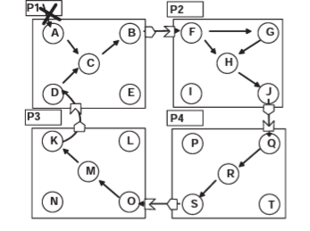

# Reading Notes for Asynchronous Complete Distributed Garbage Collection

## Outcomes

- describe a Distributed Garbage Collection (DGC) algorithm capable of reclaiming distributed cycles of garbage asynchronously and efficiently. 
- does not require any particular coordination between processes and it tolerates message loss.

## Assumptions

- periodically, each process stores a snapshot of its internal object graph on disk

- the snapshots provides a consistent view for a sub-graph being independently traced

- there can be no invocations along the distributed sub-path to be included in the CDM-Graph.

## Algorithm 

### Definitions

For Scions: 

- *StubsFrom*: list of stubs, in the same process, transitively reachable from the scion.

For Stubs: 

- *ScionsTo* : list of scions, in the same process, that transitively lead to the stub.

- *Local.Reach* : flag-bit accounting for local reachability (i.e., from the local root of the enclosing process) of the stub.

### Steps

- pick a node as entry point

- find StubsFrom or ScionsTo of the node

- add stubs and scions to { {Scions} -> {Stubs} }

- send the set to next server (the server is where the newly found stubs and scions are located)

- repeat steps2 - 4 until {Scions} is equal to {Stubs} - which means we found a cycle; or the path ends and there is no cycle

